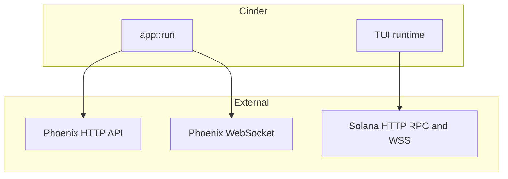

# Cinder

**Cinder** is a Rust terminal UI for [Phoenix](https://phoenix.trade) perpetuals on Solana: live charts, a merged on-chain **spline** + optional **CLOB** order book, market and wallet flows, and signed transactions from the shell.


## Features

- **Markets** — Loads Active / PostOnly markets from the Phoenix HTTP API; background refresh about every 60s.
- **Spline Liquidity** — `accountSubscribe` to the market’s on-chain spline account for ladder-style liquidity.
- **CLOB Liquidity** — Optional merge of FIFO L2 levels from the market orderbook account (toggle in user config).
- **Top positions** — Periodic scan of the protocol-wide Active Trader Buffer for a leaderboard-style modal (`T`).
- **Trading** — Market / limit / stop-style flows with confirmation modals; deposits and withdrawals when a wallet is loaded.
- **i18n** — UI strings in English and Chinese.

Quit with **`q`** (confirm) or **Ctrl+C**.

## Architecture



## Environment

| Variable | Required | Description |
|----------|----------|-------------|
| `RPC_URL` or `SOLANA_RPC_URL` | Yes | Solana HTTP RPC |
| `RPC_WS_URL` or `SOLANA_WS_URL` | No | WebSocket endpoint (inferred from HTTP when omitted) |
| `PHX_WALLET_PATH` or `KEYPAIR_PATH` | No | Keypair file (default `~/.config/solana/id.json`) |
| `RUST_LOG` | No | e.g. `info` or `cinder=debug,phoenix_rise=warn` |
| `CINDER_LOG_DIR` | No | Directory for transaction error logs (default `~/.config/phoenix-cinder/logs`) |

## Build and run

```bash
# Debug
cargo build
cargo run

cargo build --release
RPC_URL=https://api.mainnet-beta.solana.com ./target/release/cinder
```

## Docker

```bash
docker compose build               # one-time (or after Cargo/source changes)
docker compose run --rm cinder     # interactive TUI run
```

For signing, mount a Solana keypair via the CLI. The binary defaults `PHX_WALLET_PATH` to `~/.config/solana/id.json`, which inside the distroless `nonroot` image resolves to `/home/nonroot/.config/solana/id.json`:

```bash
docker compose run --rm \
  -v "$HOME/.config/solana/id.json:/home/nonroot/.config/solana/id.json:ro" \
  cinder
```

Or set a custom path:

```bash
docker compose run --rm \
  -v "/path/to/key.json:/wallet/id.json:ro" \
  -e PHX_WALLET_PATH=/wallet/id.json \
  cinder
```

## License

MIT