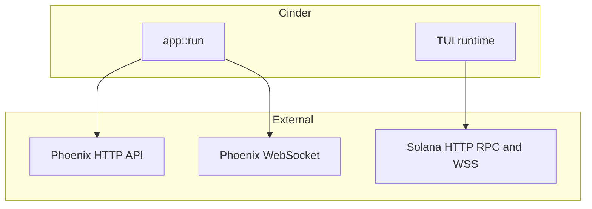

# Cinder

**Cinder** is a Rust terminal UI for [Phoenix](https://phoenix.trade) perpetuals on Solana: live charts, a merged on-chain **spline** + optional **CLOB** order book, market and wallet flows, and signed transactions from the shell.


<p align="center">
  
</p>

> 🔥 **No Phoenix invite yet?** Sign up through Cinder's referral and qualify for the current **Phoenix fee discount** (10% off fees) — see [Referral Funding](#referral-funding) below, or visit [cosmic.markets/phoenix/trade](https://cosmic.markets/phoenix/trade) to register with the `COSMIC` code.

## Features

- **Markets** — Loads Active / PostOnly markets from the Phoenix HTTP API; background refresh about every 60s.
- **Spline Liquidity** — `accountSubscribe` to the market’s on-chain spline account for ladder-style liquidity.
- **CLOB Liquidity** — Optional merge of FIFO L2 levels from the market orderbook account (toggle in user config).
- **Top positions** — Periodic scan of the protocol-wide Active Trader Buffer for a leaderboard-style modal (`T`).
- **Trading** — Market / limit / stop-style flows with confirmation modals; deposits and withdrawals when a wallet is loaded.
- **i18n** — UI strings in English, Chinese, Spanish, and Russian.

Quit with **`q`** (confirm) or **Ctrl+C**.

## Architecture



## Environment

| Variable | Required | Description |
|----------|----------|-------------|
| `RPC_URL` or `SOLANA_RPC_URL` | Recommended | Solana HTTP RPC. **If unset, Cinder falls back to the public `https://api.mainnet-beta.solana.com`** — public RPC is workable for basic trading. private RPC is recommended for speed. [helius](https://helius.dev) is our recommended private RPC provider |
| `RPC_WS_URL` or `SOLANA_WS_URL` | No | WebSocket endpoint (inferred from HTTP when omitted) |
| `PHX_WALLET_PATH` or `KEYPAIR_PATH` | No | Keypair file path (see [Wallet path resolution](#wallet-path-resolution) below) |
| `CINDER_FANOUT_PUBLIC_RPC` | No | `0`/`false`/`off`/`no` disables the public-RPC fan-out (see below). Anything else (or unset) keeps the default `on`. The setting is also user-toggleable in the in-app config modal (`[c]`); the persisted value wins once toggled. |
| `RUST_LOG` | No | e.g. `info` or `cinder=debug,phoenix_rise=warn` |
| `CINDER_LOG_DIR` | No | Directory for transaction error logs (default `~/.config/phoenix-cinder/logs`) |

### Public RPC fan-out

By default, every signed transaction is sent to **both** your configured primary RPC **and** the public `api.mainnet-beta.solana.com` endpoint. The primary RPC remains authoritative for confirmation; the secondary send is fire-and-forget and used purely for delivery reliability when a private/paid RPC is slow or drops the submission.

If you would rather your submissions stay solely on your configured RPC (e.g. for privacy reasons, or because your provider already provides redundant submission), turn the fan-out off via the config modal (`[c] → Public RPC fanout → Off`) or set `CINDER_FANOUT_PUBLIC_RPC=0` before launch.

### Wallet path resolution

When `PHX_WALLET_PATH` is unset, Cinder tries the following candidates in order and uses the first one that exists and decodes:

1. `phoenix.json` in the current working directory
2. `PHX_WALLET_PATH` / `KEYPAIR_PATH` (if either is set)
3. `~/.config/solana/id.json` (the standard Solana CLI location)

If you keep multiple wallets, be aware that a `phoenix.json` next to the binary takes priority over both env vars and the Solana CLI default. Delete or rename it to avoid signing with an unintended wallet.

## Build and run

```bash
# Debug
cargo build
cargo run

cargo build --release
RPC_URL=https://api.mainnet-beta.solana.com ./target/release/cinder
```

Pre-compiled binaries for Windows and Linux are available in the Releases.

## Docker

```bash
docker compose build               # one-time (or after Cargo/source changes)
docker compose run --rm cinder     # interactive TUI run
```

For signing, mount a Solana keypair via the CLI. The binary defaults `PHX_WALLET_PATH` to `~/.config/solana/id.json`, which inside the distroless `nonroot` image resolves to `/home/nonroot/.config/solana/id.json`:

```bash
docker compose run --rm \
  -v "$HOME/.config/solana/id.json:/home/nonroot/.config/solana/id.json:ro" \
  cinder
```

## Referral Funding
Cinder is partially funded through Phoenix's referral program. The first time a wallet with no Phoenix account connects, Cinder shows a choice modal where you can pick the `COSMIC` referral (qualifies for Phoenix's current fee-discount program — discount and rules are set by Phoenix and subject to change), enter a custom code from someone else, or continue without one. Cinder earns a share of trading fees from wallets that register with `COSMIC`, and it's a great way to support the project.

Phoenix referral attribution is permanent: once a wallet is activated with a referral code, the attribution cannot be changed later.

## Risk Disclaimer
Trading perpetual futures is high-risk and can result in the rapid and total loss of your funds. Cinder is provided **as-is** under the MIT license with no warranties; the authors are not liable for any losses, missed fills, RPC outages, on-chain errors, or other issues arising from use of this software. You are solely responsible for your trades, your keys, and your compliance with the laws of your jurisdiction. Nothing in this project is financial advice.

## Acknowledgments
Huge thanks to the team at **Ellipsis Labs** for building [Phoenix](https://phoenix.trade) — the Solana perpetuals protocol Cinder is built on top of. Cinder is an independent, open-source TUI client and is not affiliated with, sponsored by, or endorsed by Ellipsis Labs. "Phoenix" and any related names, logos, or marks are trademarks of their respective owners and are used here only to identify the protocol Cinder interoperates with.

# Donations
❤️ Donations are greatly appreciated: cosmic.sol

## License
MIT