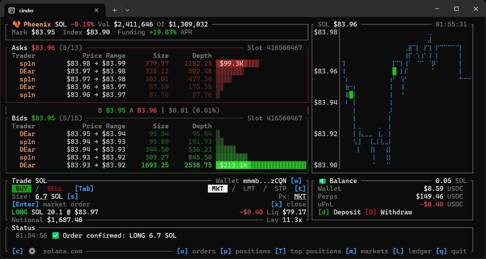
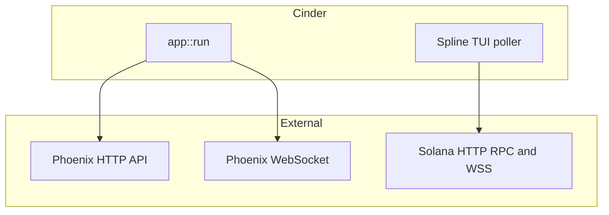

# Cinder

**Cinder** is a Rust terminal UI for [Phoenix](https://phoenix.trade) perpetuals on Solana: live charts, a merged on-chain **spline** + optional **CLOB** order book, market and wallet flows, and signed transactions from the shell.




## Features

- **Markets** — Loads Active / PostOnly markets from the Phoenix HTTP API; background refresh about every 60s.
- **Stats** — Per-symbol WebSocket updates (e.g. mark, volume, 24h change).
- **Spline** — `accountSubscribe` to the market’s on-chain spline account for ladder-style liquidity.
- **CLOB** — Optional merge of FIFO L2 levels from the market orderbook account (toggle in user config).
- **GTI** — In-memory Global Trader Index cache so book rows can show wallet authorities instead of opaque pointers.
- **Top positions** — Periodic scan of the protocol-wide Active Trader Buffer for a leaderboard-style modal (`T`).
- **Trading** — Market / limit / stop-style flows with confirmation modals; deposits and withdrawals when a wallet is loaded.
- **i18n** — UI strings in English and Chinese.

Quit with **`q`** (confirm) or **Ctrl+C**.

## Architecture



**Modals and overlays:** market picker (`m`), positions (`p`), open orders (`o`), top positions (`T`), config (`c`), activity ledger (`L`), and **y** / **n** confirmations.

**Order mode:** `t` cycles Market → Limit → Stop (trigger). `e` edits limit or stop price; `s` edits size.

In lists, use **↑** / **↓** and **Enter** where shown. **Esc** backs out of modals.

**Size presets:** `0.01` through `500.0` (default step `0.1`). See `ORDER_SIZE_PRESETS` in `src/spline/constants.rs`.

## Requirements

- **Rust** toolchain (2021 edition; see `rust-version` in `Cargo.toml`).
- `cargo fmt` uses the checked-in `rustfmt.toml`.
- A **Solana JSON-RPC HTTP** endpoint (`RPC_URL`). WebSocket URL is optional and can be derived from HTTP.
- Optional **keypair** JSON for live trading and wallet-scoped views (env vars below).

## Environment

| Variable | Required | Description |
|----------|----------|-------------|
| `RPC_URL` or `SOLANA_RPC_URL` | Yes | Solana HTTP RPC |
| `RPC_WS_URL` or `SOLANA_WS_URL` | No | WebSocket endpoint (inferred from HTTP when omitted) |
| `PHX_WALLET_PATH` or `KEYPAIR_PATH` | No | Keypair file (default `~/.config/solana/id.json`) |
| `RUST_LOG` | No | e.g. `info` or `cinder=debug,phoenix_rise=warn` |
| `CINDER_LOG_DIR` | No | Directory for transaction error logs (default `~/.config/phoenix-cinder/logs`) |

`dotenvy` loads a **`.env`** in the working directory when present.
Use `.env.example` as a template and never commit wallet keypairs or private RPC credentials.

## Trading safety

Cinder can sign real Solana transactions. The release defaults favor safety:

- Transaction sends run RPC preflight before broadcast.
- Order and close sizes are checked before converting to on-chain base lots.
- Deposit and withdrawal amounts must be finite, positive, and within the release safety limit.
- A confirmation timeout means the transaction status is unknown, not failed. Check the displayed signature before retrying.
- Raw transaction errors are written to `cinder-error.log` under the Cinder log directory rather than the current working directory.

## Build and run

```bash
# Debug
cargo build
cargo run

# Release (profile tuned for size in Cargo.toml)
cargo build --release
RPC_URL=https://api.mainnet-beta.solana.com ./target/release/cinder
```

**Tests and lint:**

```bash
cargo fmt --all --check
cargo clippy --workspace --locked --all-targets -- -D warnings
cargo test --workspace --locked
```

## Docker

```bash
docker compose build               # one-time (or after Cargo/source changes)

docker compose run --rm cinder     # interactive TUI run
```

Set **`RPC_URL`** in your shell env (or a local **`.env`**). Optional overrides: **`RPC_WS_URL`** (derived from **`RPC_URL`** when unset — note that the Compose service uses the bare-key form `RPC_WS_URL` so an unset value is *not* injected as an empty string, which would make the binary hang on a malformed WSS URL), and **`RUST_LOG`**.

For signing, mount a Solana keypair via the CLI. The binary defaults `PHX_WALLET_PATH` to `~/.config/solana/id.json`, which inside the distroless `nonroot` image resolves to `/home/nonroot/.config/solana/id.json`:

```bash
docker compose run --rm \
  -v "$HOME/.config/solana/id.json:/home/nonroot/.config/solana/id.json:ro" \
  cinder
```

Or set a custom path:

```bash
docker compose run --rm \
  -v "/path/to/key.json:/wallet/id.json:ro" \
  -e PHX_WALLET_PATH=/wallet/id.json \
  cinder
```

## Contributing and security

See `CONTRIBUTING.md` for local development and PR expectations. Report
vulnerabilities through `SECURITY.md`.

## License

Cinder is MIT licensed; see `LICENSE`. The vendored
`crates/phoenix-eternal-types` workspace member is Apache-2.0 licensed; see
`crates/phoenix-eternal-types/LICENSE` and `NOTICE`.
