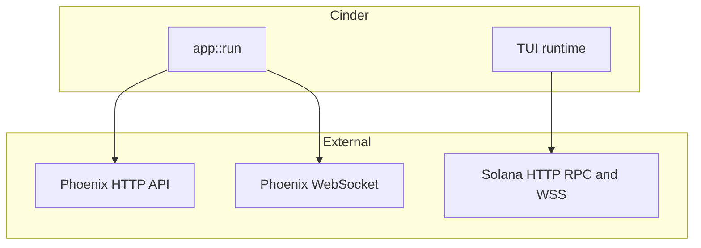

# Cinder

**Cinder** is a Rust-based trading terminal for [Phoenix](https://phoenix.trade) perpetuals on Solana: live charts, a merged on-chain **spline** + optional **CLOB** order book, market and wallet flows, trading, and signed transactions from the shell.


[](https://github.com/cosmic-markets/cinder/stargazers)
[](https://discord.com/invite/XhQrN8FA2C)
[](https://x.com/cosmic_markets)

<p align="center">
  
</p>

> 🔥 **No Phoenix invite yet?** Sign up through Cinder's referral and qualify for the current **Phoenix fee discount** (10% off fees) — see [Referral Funding](#referral-funding) below, or visit [cosmic.markets/phoenix/trade](https://cosmic.markets/phoenix/trade) to register with the `COSMIC` code.

## ✨ Features

- **Markets** — Active and PostOnly Phoenix markets from the HTTP API, auto-refreshed in the background about once a minute.
- **Spline depth** — Subscribes to each market’s on-chain spline account via Solana WebSocket (`accountSubscribe`) and draws ladder-style liquidity from live updates.
- **CLOB depth (optional)** — Merges in FIFO L2 levels from the market orderbook account for a fuller book; enable it in user config.
- **Top positions** — Periodically reads the protocol-wide Active Trader Buffer; open the leaderboard-style modal with **`T`**.
- **Trading and wallet** — Market, limit, and stop-style flows with confirmation dialogs; with a keypair loaded, deposit and withdraw from the TUI.
- **Languages** — Built-in UI copy for English, Chinese, Spanish, and Russian.

## 📦 Install

The easiest way to run Cinder is from [crates.io](https://crates.io/crates/cosmic-cinder). The published crate is named **`cosmic-cinder`**; Cargo installs the **`cinder`** executable (same name as when you build from this repository). If you prefer not to use Cargo, download pre-built Windows and Linux binaries from [GitHub Releases](https://github.com/cosmic-markets/cinder/releases).

To use Cargo, you need the Rust toolchain: install it with **[rustup](https://rustup.rs/)** (official installer; includes `cargo` and `rustc` for Windows, macOS, and Linux). Then run:

```bash
cargo install cosmic-cinder
cinder
```

Ensure `~/.cargo/bin` (or `$CARGO_HOME/bin` if you set `CARGO_HOME`) is on your `PATH` so the shell can find `cinder` after install.

## Architecture



## Environment

| Variable | Required | Description |
|----------|----------|-------------|
| `RPC_URL` or `SOLANA_RPC_URL` | Recommended | Solana HTTP RPC. **If unset, Cinder falls back to the public `https://api.mainnet-beta.solana.com`** — public RPC is workable for basic trading. private RPC is recommended for speed. [helius](https://helius.dev) is our recommended private RPC provider |
| `RPC_WS_URL` or `SOLANA_WS_URL` | No | WebSocket endpoint (inferred from HTTP when omitted) |
| `PHX_WALLET_PATH` or `KEYPAIR_PATH` | No | Keypair file path (see [Wallet path resolution](#wallet-path-resolution) below) |
| `CINDER_FANOUT_PUBLIC_RPC` | No | `0`/`false`/`off`/`no` disables the public-RPC fan-out (see below). Anything else (or unset) keeps the default `on`. The setting is also user-toggleable in the in-app config modal (`[c]`); the persisted value wins once toggled. |
| `CINDER_SKIP_ORDER_CONFIRMATION` | No | `1`/`true`/`on`/`yes` makes new orders submit immediately on Enter, bypassing the `[Y/N]` prompt. Anything else (or unset) keeps the default `off` (prompt required). The setting is also user-toggleable in the in-app config modal (`[c]`); the persisted value wins once toggled. Only affects placing new orders — closes, cancels, deposits, and withdrawals still prompt. |
| `CINDER_SKIP_PREFLIGHT` | No | `1`/`true`/`on`/`yes` sets `skip_preflight: true` on every transaction Cinder broadcasts. Anything else (or unset) keeps the default `off`. Faster on slow/congested RPCs but loses the early simulation-failure signal — bad transactions still land and burn fees. The setting is also user-toggleable in the in-app config modal (`[c]`); the persisted value wins once toggled. |
| `RUST_LOG` | No | e.g. `info` or `cinder=debug,phoenix_rise=warn` |
| `CINDER_LOG_DIR` | No | Directory for transaction error logs (default `~/.config/phoenix-cinder/logs`) |

### Public RPC fan-out

By default, every signed transaction is sent to **both** your configured primary RPC **and** the public `api.mainnet-beta.solana.com` endpoint. The primary RPC remains authoritative for confirmation; the secondary send is fire-and-forget and used purely for delivery reliability when a private/paid RPC is slow or drops the submission.

If you would rather your submissions stay solely on your configured RPC (e.g. for privacy reasons, or because your provider already provides redundant submission), turn the fan-out off via the config modal (`[c] → Public RPC fanout → Off`) or set `CINDER_FANOUT_PUBLIC_RPC=0` before launch.

### Wallet path resolution

When `PHX_WALLET_PATH` is unset, Cinder tries the following candidates in order and uses the first one that exists and decodes:

1. `phoenix.json` in the current working directory
2. `PHX_WALLET_PATH` / `KEYPAIR_PATH` (if either is set)
3. `~/.config/solana/id.json` (the standard Solana CLI location)

If you keep multiple wallets, be aware that a `phoenix.json` next to the binary takes priority over both env vars and the Solana CLI default. Delete or rename it to avoid signing with an unintended wallet.

## Build from source

If you are developing Cinder or need an unreleased build, clone the repository and run from the workspace root:

```bash
# Debug
cargo build
cargo run

cargo build --release
RPC_URL=https://api.mainnet-beta.solana.com ./target/release/cinder
```

For a published release without building locally, prefer **`cargo install cosmic-cinder`** ([Install](#install)) or pre-compiled binaries (Windows and Linux) from the repository Releases.

## Docker

```bash
docker compose build               # one-time (or after Cargo/source changes)
docker compose run --rm cinder     # interactive TUI run
```

For signing, mount a Solana keypair via the CLI. The binary defaults `PHX_WALLET_PATH` to `~/.config/solana/id.json`, which inside the distroless `nonroot` image resolves to `/home/nonroot/.config/solana/id.json`:

```bash
docker compose run --rm \
  -v "$HOME/.config/solana/id.json:/home/nonroot/.config/solana/id.json:ro" \
  cinder
```

## Referral Funding
Cinder is partially funded through Phoenix's referral program. The first time a wallet with no Phoenix account connects, Cinder shows a choice modal where you can pick the `COSMIC` referral (10% off fees), enter a custom code from someone else, or continue without one. Cinder earns a share of trading fees from wallets that register with `COSMIC`, and it's a great way to support the project.

Phoenix referral attribution is permanent: once a wallet is activated with a referral code, the attribution cannot be changed later.

## Risk Disclaimer
Trading perpetual futures is high-risk and can result in the rapid and total loss of your funds. Cinder is provided **as-is** under the MIT license with no warranties; the authors are not liable for any losses, missed fills, RPC outages, on-chain errors, or other issues arising from use of this software. You are solely responsible for your trades, your keys, and your compliance with the laws of your jurisdiction. Nothing in this project is financial advice.

## Acknowledgments
Thanks to the team at **Ellipsis Labs** for building [Phoenix](https://phoenix.trade). Cinder is an independent, open-source TUI client and is not affiliated with, sponsored by, or endorsed by Ellipsis Labs. "Phoenix" and any related names, logos, or marks are trademarks of their respective owners and are used here only to identify the protocol Cinder interoperates with.

## Donations
❤️ SOL donations: `cosmic.sol`

## License
MIT